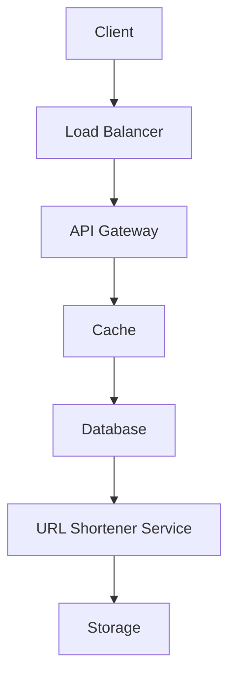

# 🧠 System Design Visualizer (AI-Powered)

An **API-first system design assistant** that uses an LLM to generate **high-level system architecture** and converts it into **Mermaid diagrams** that render directly in GitHub.

This project focuses on **controlling AI output**, **normalizing semi-structured text**, and producing **deterministic, documentation-ready diagrams**.

---

## ✨ Problem Statement

AI-generated system design answers are often:
- Long and unstructured
- Hard to visualize
- Difficult to convert into diagrams

This project solves that by:
1. Generating structured system design using an LLM
2. Extracting only **architecture-level components**
3. Normalizing them into **Mermaid-safe syntax**
4. Producing diagrams that render cleanly in GitHub

---

## 🏗️ How It Works

```text
User Input
   ↓
LLM (Groq)
   ↓
Structured Design Text
   ↓
Component Extraction
   ↓
Normalization Layer
   ↓
Mermaid Diagram Output
```
## 🛠️ Tech Stack
- Backend: FastAPI
- LLM Provider: Groq
- Language: Python
- Diagram Format: Mermaid
- API Docs: Swagger (OpenAPI)

## 📊 Sample Architecture Diagram
Below is a sample Mermaid diagram generated by the system:


## 🧠 Key Engineering Decisions

- API-first design (UI-agnostic and extensible)
- Strict scope control (only architecture in diagrams)
- Normalization layer to prevent broken Mermaid syntax
- Clear separation of concerns
  - Routes → orchestration
  - Generators → parsing & rendering
  - LLM → content generation

## 🔮 Future Enhancements

- Auto-generate Markdown files with diagrams
- Support additional diagram types (ER, Sequence)
- Simple UI for real-time visualization
- Export diagrams as images or PDFs

## 👤 Author

Ganesh Tekkem  

Backend & AI-Focused Software Engineer  

LinkedIn: https://www.linkedin.com/in/tekkemganesh/


